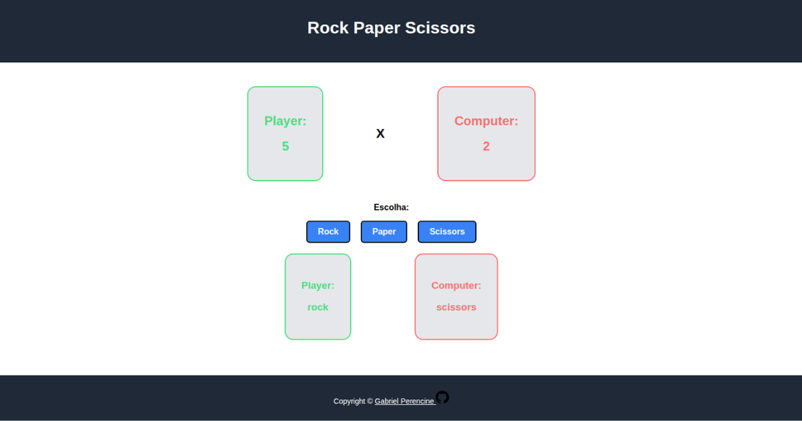

# Rock Paper Scissors

This project is part of the Foundations course from **The Odin Project**. In this project, I built a browser-based implementation of the classic Rock Paper Scissors game using HTML, CSS, and JavaScript.

## Preview

By completing this project, I demonstrated an understanding of core JavaScript concepts, including functions, variables, conditional statements, event handling, DOM manipulation, random value generation, scope, and application state management. I also strengthened my ability to build interactive user interfaces, separate presentation from application logic, and organize code into reusable functions.

This project marked my first experience developing an interactive web application with JavaScript and provided a solid foundation for developing more complex interactive applications in future projects.